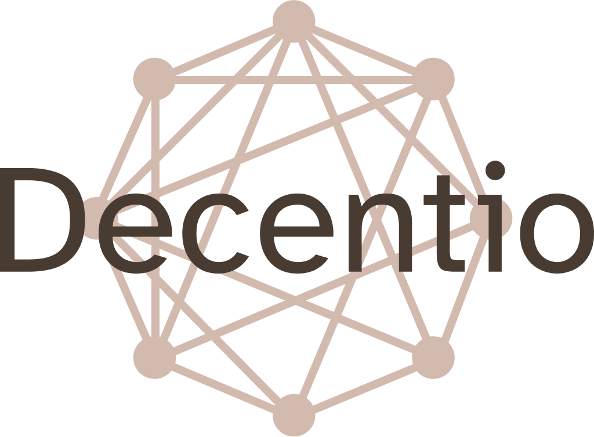

<h1 align="center"> Decentio </h1>

</>

Decentio je chatovací aplikace navržena s použitím nejnovějších technologií. Jedná se o testovací aplikaci na které má být otestována architektura moderních chatovacíh aplikací s použitím aktualně nejnovějších technologií. Aplikace je součástí praktické části diplomové práce.

Aplikace je sestavena na základě analýzi architektur znamých a používaných chatovacích aplikací jako je WhatsApp a Messenger.

</>

### Autoři

* **Jan Zahradník** - *Celý projekt* - [Jan Zahradník](https://github.com/ocasusMaximus)
