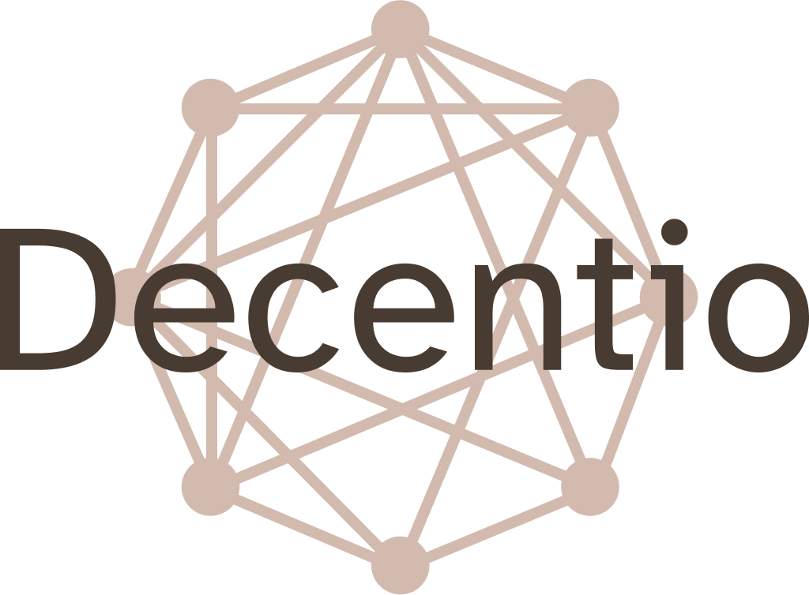
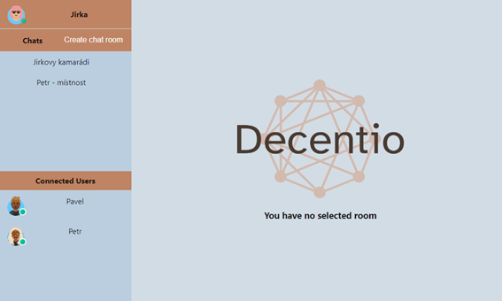

<h1 align="center"> Decentio </h1>

</>

Decentio is chat app made with help of decentralized architecture based on IPFS technology. Application is demonstration of chat app based on a different approach using decentralized architecture. Application was part of diploma theses.

 Decentio contains solution of user basic requirements on chat app with help of IPFS. Requirements are solved according to conclusions from analysis from part of diploma theses.

</>

## Startup guide

1. Clone repo
2. npm install in terminal of cloned repo
3. npm start in terminal of cloned repo
4. App runs on localhost:3000 by default
5. Data are being stored in your browser
6. You can test app using different browsers or anonymous mode

### Authors

- **Jan Zahradník** - _Whole project_ - [Jan Zahradník](https://github.com/zahradjan)
